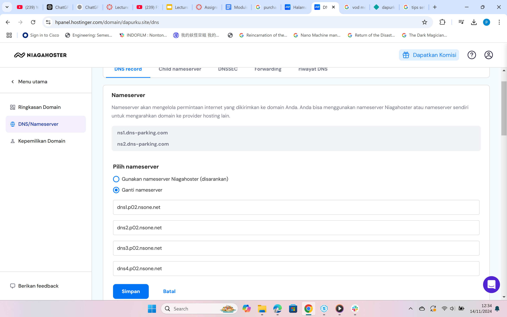

# Dapurku

## Deskripsi

Ini adalah projek website Dapurku yang dikembangkan menggunakan HTML5. Ini berfungsi sebagai pondasi untuk struktur dasar situs web Dapurku dengan menggunakan semantic html.

## Fitur

Adapun fitur pada website sebagai berikut:

- Structur Semantic HTML5
- Navbar
- List Layanan
- Kontak Form dengan variasi input data

## Bagian

1. **Header**: Berisi logo, nama restoran, dan menu navigasi.
2. **Hero**: Berisi dengan tagline dan tombol Jelajahi layanan kami.
3. **About**: Memberikan informasi tentang Dapurku dan penawarannya.
4. **Gallery**: Menampilkan beberapa foto galeri dari Dapurku
5. **Services**: Menyoroti layanan utama - pemesanan makanan online dan reservasi meja.
6. **Contact**: Berisi formulir kontak dan informasi kontak restoran.
7. **Footer**: Menampilkan logo, tautan cepat, dan pemberitahuan hak cipta.

## Preview

# Deployment Using Netlify

## Deployment Instructions

### 1. Sign in to Netlify
Buka Netlify dan login ke akun kamu.

### 2. Connect Git Repository

- Klik "Add new site" dan pilih "Import an existing project" di dashboard Netlify.

- Pilih Git provider (GitHub, GitLab, atau Bitbucket).

- Cari repository proyek kamu dan pilih repository tersebut.

### 3. Configure Deployment Settings

- Pada bagian "Branch to deploy", pilih branch yang ingin di-deploy (biasanya main atau master).
- Tambahkan build command dan publish directory sesuai dengan framework yang digunakan. Karena projek ini tidak menggunakan framework apapun maka tidak perlu diisi.

### 4. Set Environment Variables (Opsional)
Jika menggunakan variabel lingkungan, tambahkan variabel-variabel tersebut di Settings > Environment Variables pada halaman proyek Netlify.

### 5. Deploy the Site
Setelah konfigurasi selesai, klik "Deploy site". Netlify akan mulai membangun dan meng-deploy website kamu.

### 6. Access the Site
Setelah proses deployment selesai, kamu akan diberikan URL unik dari Netlify. Buka URL tersebut untuk mengakses website kamu.

## Netlify Site URL
- Live Site: [Dapurku](https://dapurku.site/).

## Custom Domain

Setelah Website Berhasil dideploy maka langkah selanjutnya adalah mengubah domain dengan domain yang kita miliki. langkah-langkah mengubah domain di netlify sebagai berikut :

- Pilih site yang sudah dideploy lalu pilih "set a custom domain" lalu masukan nama domain kemudian klik "verify".

Setelah di verify maka website kita sudah terhubung dengan domain yang baru 

## DNS Management

Setelah Domain dirubah langkah selanjutnya adalah menambah DNS Record. Domain Name System (DNS) server adalah sistem yang berfungsi untuk menerjemahkan nama domain menjadi alamat IP. DNS server bekerja sebagai jembatan antara nama domain dan alamat IP yang digunakan komputer untuk menemukan lokasi situs web.

- Masuk ke site yang dideploy lalu pilih menu "Domain Management". Pada Primary Domain, pilih Options -> Set up Netlify DNS. setelah diklik akan tampil halaman berikut:

Tekan "verify" lalu tekan "Add Domain" maka beberapa DNS tampil seperti berikut

Lalu tekan "Done"

Salin keempat nama server tersebut ke Domain Provider. Karena domain yang didapat dari Niagahoster, maka salinlah keempat nama tersbut ke dalam Niagahoster.

Jika sudah system akan mempropagasi domain ke nameserver baru dengan durasi proses 24 jam.

## Redeployment
Setiap kali kamu melakukan perubahan di branch yang terhubung, Netlify akan otomatis melakukan redeployment.

## Troubleshooting
Jika terjadi masalah, cek:

- Deployment Logs: Cek log di tab Deploys pada halaman proyek di Netlify.
- Environment Variables: Pastikan variabel lingkungan sudah benar.
- Build Command and Publish Directory: Pastikan sesuai dengan konfigurasi framework yang digunakan.
